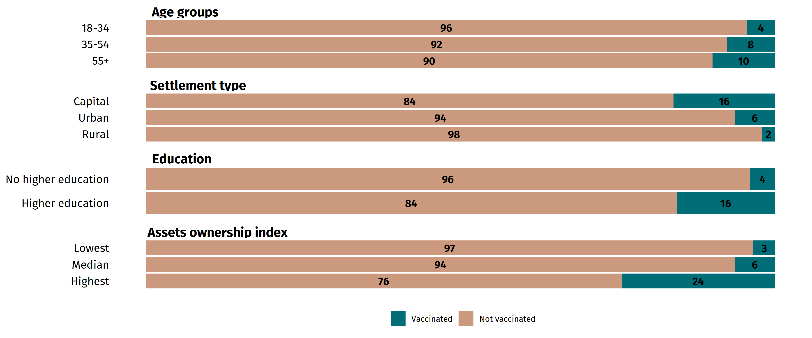

```{r include=F, eval=TRUE}
# install.packages("bookdown")
stataexe <- "C://Program Files//Stata17//StataSE-64.exe"

library(bookdown)
library(pagedown)
library(Statamarkdown)
library(tidyverse)
library(extrafont)
library(xfun)
library(redoc)

loadfonts(device = "win")
```

```{r setup, include=F, eval=FALSE}

knitr::opts_chunk$set(echo = TRUE, engine.path = list(stata = stataexe))
```

```{stata stata-setup, include = F, eval=TRUE}
# Source recode file

do scripts/recode.do


```

```{r include=F, echo=T, eval=TRUE}

# Source chart maker script

source("scripts/charts.R")

```

Fast and timely rollout of COVID-19 vaccines is essential for keeping the pandemic at bay. While far-reaching immunization helps save lives, it also helps with quickly reopening the economy and, thus, works to curb any economic crisis that a country might face. Nevertheless, not everyone has access to life-saving vaccines. Rich countries [were quick to hoard doses](https://www.theguardian.com/world/ng-interactive/2021/jun/28/vaccine-inequality-how-rich-countries-cut-covid-deaths-as-poorer-fall-behind){#guardian} to vaccinate their populations, while poorer states lagged behind. The World Health Organization estimated that if low income countries had the same vaccine rollout rate as high income nations, [they would add almost \$ USD 40 billion to their GDP forecast](https://www.who.int/news/item/22-07-2021-vaccine-inequity-undermining-global-economic-recovery){#who_link}. Overall, t[he International Monetary Fund asserted](https://www.ft.com/content/28f8c13d-2dc3-4106-a48e-4c628f392a09https://www.ft.com/content/28f8c13d-2dc3-4106-a48e-4c628f392a09){#imf_link} that vaccine inequality will likely mitigate efforts of global economic recovery, in no small part because of these trends.

Unequal access to COVID-19 vaccines within countries threatens the effective and timely mitigation of the pandemic. Notably, even in countries boasting high rates of vaccine rollout, such as the [UK](https://www.ncbi.nlm.nih.gov/pmc/articles/PMC7927589/){#nih_uk} and [Israel](https://www.medrxiv.org/content/medrxiv/early/2021/06/22/2021.06.14.21258882.full.pdf){#med_isr}, COVID-19 vaccines are less accessible to vulnerable and disadvantaged populations. As recent CRRC/ND data shows, Georgia is no exception.

Despite initial success in curbing the COVID-19 pandemic, Georgia has done [considerably worse](https://oc-media.org/features/datablog-data-suggests-georgia-has-handled-the-pandemic-poorly/){#givi-oc} in managing infection rates and vaccinations than its neighbors. In the first ten days of August 2021, for example, the country has led global league tables in infection and death rates per 100,000 residents, while simultaneously significantly lagging behind in immunization.

```{r include=T, echo=F, fig.height=4, fig.width=8, echo=F, warning=F, message=F}



```

As of July 25, 2021, when the last interviews of the CRRC/NDI survey were administered, about `r round(vaccinated$prop[vaccinated$var=="Vaccinated"], 0)` percent of Georgians reported receiving at least one dose of the COVID-19 vaccine. The Georgian government initially prioritized vaccinating older people, so this group is slightly more likely to be inoculated (`r round(vaccinated_demography$prop[vaccinated_demography$labels=="Vaccinated" & vaccinated_demography$cat=="55+"], 0)` %) than those younger than 35 (`r round(vaccinated_demography$prop[vaccinated_demography$labels=="Vaccinated" & vaccinated_demography$cat=="18-34"], 0)`%) and between 35 and 54 (`r round(vaccinated_demography$prop[vaccinated_demography$labels=="Vaccinated" & vaccinated_demography$cat=="35-54"], 0)`%). More Tbilisi residents (`r round(vaccinated_demography$prop[vaccinated_demography$labels=="Vaccinated" & vaccinated_demography$cat=="Tbilisi"], 0)` %) than those from other urban areas (`r round(vaccinated_demography$prop[vaccinated_demography$labels=="Vaccinated" & vaccinated_demography$cat=="Urban"], 0)` %) and rural areas (`r round(vaccinated_demography$prop[vaccinated_demography$labels=="Vaccinated" & vaccinated_demography$cat=="Rural"], 0)` %) managed to receive at least one dose of any available COVID-19 vaccine.

Notably, the respondent's socio-economic status predicts whether they were able to get vaccinated. About `r round(vaccinated_demography$prop[vaccinated_demography$labels=="Vaccinated" & vaccinated_demography$cat=="Higher education"], 0)` % of Georgians with higher education received at least one dose, as opposed to a mere `r round(vaccinated_demography$prop[vaccinated_demography$labels=="Vaccinated" & vaccinated_demography$cat=="No higher education"], 0)`% of those with no higher education. About a quarter of respondents with the highest socio-economic standing in the country (as measured by assets ownership index) received at least one dose, compared to `r round(vaccinated_demography$prop[vaccinated_demography$labels=="Vaccinated" & vaccinated_demography$cat=="Median"], 0)`% of those with median, and `r round(vaccinated_demography$prop[vaccinated_demography$labels=="Vaccinated" & vaccinated_demography$cat=="Lowest"], 0)`% of Georgians within the lowest socio-economic bracket.

A lack of information might be one likely contributor to low immunization rates. The research indicates that those groups who were least likely to be vaccinated also claimed that they did not have information on the immunization process. For instance, only `r round(not_enough_information_demography$prop[not_enough_information_demography$cat=="Highest" & not_enough_information_demography$group == "Assets ownership index"], 0)`% with the highest socio-economic status say that they did not have enough information on the vaccination process in Georgia, compared to almost half of those within the median (`r round(not_enough_information_demography$prop[not_enough_information_demography$cat=="Median"], 0)`) and lowest standing on the socio-economic bracket (`r round(not_enough_information_demography$prop[not_enough_information_demography$cat=="Lowest"], 0)`). A large share of Georgians with no higher education (`r round(not_enough_information_demography$prop[not_enough_information_demography$cat=="No higher education"], 0)`%) stated that they did not have enough information on vaccination, than `r round(not_enough_information_demography$prop[not_enough_information_demography$cat=="Higher education"], 0)` % of those who had attained a higher education degree.

There were also geographic variations. For example, only one-third of Tbilisians contended not having enough information about Georgia's immunization process, while `r round(not_enough_information_demography$prop[not_enough_information_demography$cat=="Urban"], 0)` % in other urban areas, and `r round(not_enough_information_demography$prop[not_enough_information_demography$cat=="Rural"], 0)` % in rural areas considered so. Not surprisingly, in the days of the initial phase of vaccine rollout, available vaccination time slots in the capital and larger urban areas were filled almost instantaneously. Many Tbilisians even booked available places in vaccination [centers outside the capital](https://www.radiotavisupleba.ge/a/31251382.html). Seemingly, this was because they had better access to information and knowledge of the online booking system. Those who resided outside the capital were put in a disadvantaged position.

While in the last few days, Georgia accelerated its immunization efforts by vaccinating [more than 20,000 people daily](https://covidinfo.ge/){#covidinfo}, it is likely that the assumptions brought up in this blog post will hold true considering the lack of pro-immunization information provided by the government and the prevalence of anti-vaccine sentiment [among](https://oc-media.org/features/datablog-why-do-georgians-not-want-to-vaccinate/) many Georgians. As more vaccine doses [become available](https://tabula.ge/ge/news/671458-mokalakeebi-pfizer-me-2-dozaze-registratsias), it is crucial that information be disseminated explaining the process and benefits of immunization, and done so in a manner that effectively reaches all Georgians.

*Differences were identified using two logistic regression model predicting (a) whether the respondent had a COVID-19 vaccine, and (b) whether they reported having not enough information on the immunization process in Georgia. Predictors in each of the models included socio-demographic variables such as gender, age, education, settlement type, ethnicity, partisanship, and assets index. Assets index is a common proxy measure of household's economic status counting the number of appliances present in the household. Lowest value corresponds to the score of 0, median value corresponds to 6, highest value of the index is 10. Replication code is available here.*

*The views expressed in this article are those of the author's alone and do not in any way reflect the views of CRRC Georgia, or any related entity.*
